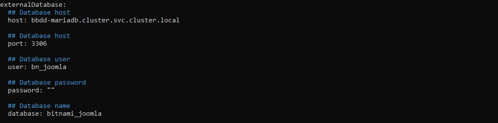
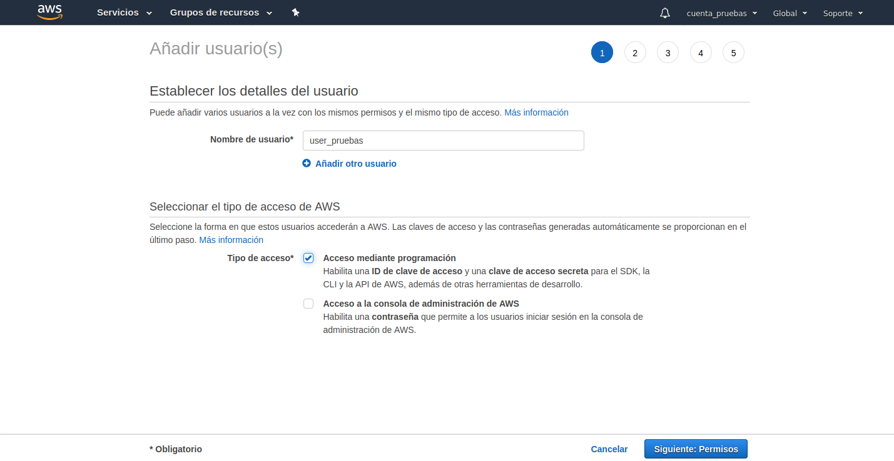
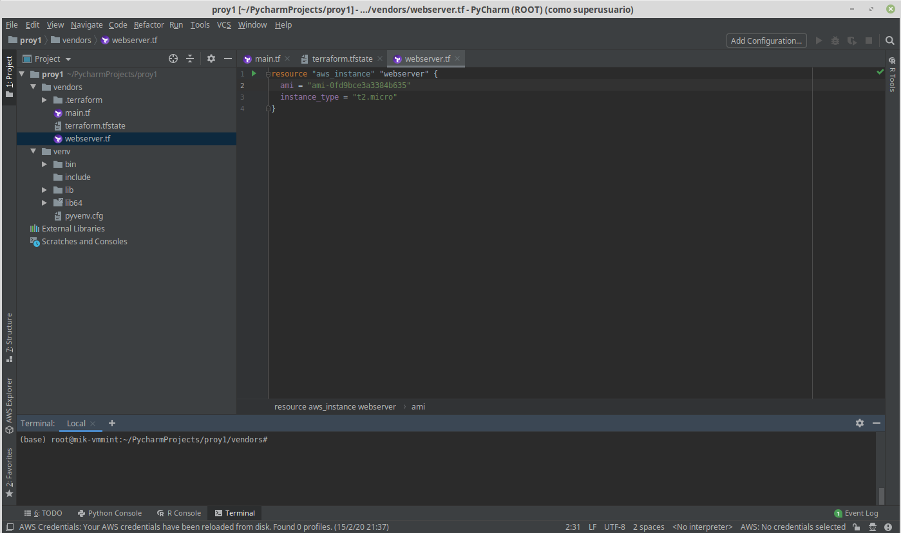

# Índice

1. [Introducción](#1-introducción)
    - 1.1 [Descripción del proyecto](#11-descripción-del-proyecto)
    - 1.2 [Arquitectura](#12-Arquitectura)
2. [Qué es kubernetes](#2-qué-es-Kubernetes)
   
3. [Instalación Kubernetes](#3-instalación)
    - 3.1 [Creación del clúster de kubernetes](#31-creación-del-clúster-de-kubernetes)
        - 3.1.1 [Chequeo de puertos](#311-chequeo-de-puertos)
        - 3.1.2 [Instalación del CRI](#312-instalación-del-CRI)
        - 3.1.3 [Instalación de kubeadm, kubelet y kubectl](#313-instalación-de-kubeadm,-kebelet-y-kubectl)
        - 3.1.4 [Inicio del clúster](#314-inicio-del-clúster)    
4. [Ampliando Kubernetes](#4-Ampliando-Kubernetes)
    - 4.1 [HELM](#41-HELM) 
    - 4.2 [CHARTMUSEUM](#42-CHARTMUSEUM)
    - 4.3 [PERCONA Y GALERA](#43-PERCONA-GALERA)
    - 4.4 [NFS-PROVISIONER](#44-NFS-PROVISIONER)
    - 4.5 [CMS](#45-CMS)
    - 4.6 [INGRESS-NGINX](#46-INGRESS-NGINX)
    - 4.7 [CERT-MANAGER](#47-CERT-MANAGER) 
    - 4.8 [METRICS SERVER Y HPA](#48-METRICS-HPA)
5. [AWS](#5-AWS)
6. [Conclusión](#6-conclusión)
7. [TODO](#7-TODO)
8. [Webgrafía](#8-webgrafía)

# 1. Introducción
NUBE HíBRIDA (HYBRID CLOUD)

Según Wikipedia Cloud computing es:

“La computación en la nube es la disponibilidad a pedido de los recursos del sistema informático, especialmente el almacenamiento de datos y la capacidad de cómputo, sin una gestión activa directa por parte del usuario. El término se usa generalmente para describir los centros de datos disponibles desde cualquier lugar para muchos usuarios “

En resumen Cloud es una infraestructura compartida que se alquila por uso, con la siguientes modalidades:

	-Public cloud:
	“Una nube pública es una nube computacional mantenida y gestionada por terceras personas no vinculadas con la organización. “

	Ejemplo: Aws (Amazon Web Services)

	-Private cloud:
	“Las nubes privadas son una buena opción para las compañías que necesitan alta protección de datos y ediciones a nivel de servicio. Las nubes privadas están en una infraestructura bajo demanda, gestionada para un solo cliente que controla qué aplicaciones debe ejecutarse y dónde. “

	En esta caso somos los administradores y propietarios de la infraestructura.

	Ejemplo: OpenStack

	-Modelo Multicloud:
	“ Este tipo de nube es un enfoque en el que se combina más de un servicio de nube formada, 	por lo menos, de dos proveedores de nube pública o privada.” 

	Por ejemplo: Azure y Aws.

Ventajas Nube publica:
- Globalmente accesibles.
- Mínima administración.
- Menor inversión inicial.
- Rápida adaptación a entorno cambiante. (En las necesidades comunes a todos los clientes)
- Actualizaciones automáticas.
- Replicación de la información entre varios CPD.

Ventajas Nube Privada:
- Datos privados más seguros.
- Administración propia y local adaptada a necesidades particulares.
- Costos fijos.
- Independencia del funcionamiento de internet. (instalaciones locales)

## 1.1. Descripción del proyecto

El proyecto se centra en demostrar las ventajas de una IAAC que tenga una parte escalable horizontalmente (mv con kubernetes) y otra escalable dinámicamente como es ECS.
Para ello se crea un clúster de **Kubernetes** con **Kubeadm** en máquinas virtuales levantadas en **VmWare** y se escala hacia una nube publica como es AWS , aprovechando esta para obtener la elasticidad dinámica necesaria. 

Este proyecto es aplicable a cualquier pyme que quiera mantener y administrar su infraestructura, pero que quiera tener una capacidad de adaptación al crecimiento de la demanda con un servicio elástico de pago por uso.

## 1.2 Arquitectura

Se propone una arquitectura con 3 nodos montados en una dmz para alojar kubernetes con todos los microservicios necesarios para ecommerce.

- **Maestro** (192.168.18.201): Ubuntu Bionic-20.04 m1.medium, funciona como máster.

- **Esclavo-1** (192.168.18.202): Ubuntu Bionic-20.04 m1.medium, actúa como nodo.

- **Esclavo-2** (192.168.18.203): Ubuntu Bionic-20.04 m1.medium, actía como nodo.

# 2. ¿Qué es Kubernetes?

**Kubernetes** es un orquestador de contenedores, al principio solo de **Docker**, escrito en **Go** anunciado por Google en 2014, siendo su versión 1.0 liberada el 21 de julio de 2015. Al mismo tiempo Google se asoció con la Linux Fundation para formar la Cloud Native Computing Foundation (CNCF) y dejaron el proyecto en sus manos.

### Kubeadm

**Kubeadm** fue una idea que nació con la salida de **Kubernetes** con el objetivo de ofrecer una herramienta que pudiera levantar clústeres de **Kubernetes** y que fuera sencillo como **Docker Swarm**. **Kubeadm** fue diseñado para la actualización, modificación o destrucción de estos clústeres siendo su primera versión lanzada como parte de **Kubernetes 1.5**. Además, también posee integración con herramientas como **Terraform** o **Ansible** para realizar grandes despliegues.

# 3. Instalación

## 3.1. Creación del clúster de kubernetes
Para la instalación de la solución kubeadm sera necesario modificar ubuntu server con las siguientes configuraciones e instalando los paquetes indicados:

### 3.1.1 Chequeo de puertos

En los puertos se abrirán los necesarios para el funcionamiento y acceso de las aplicaciones:

- Todos los **nodos**:

    Puerto 22: SSH

    Puerto 10250: Kubelet API

    Puertos 30000-32767: servicio NodePort (mapeo de puertos del host)

- Además en el **maestro**:

    Puerto 6443: Kubernetes API server
    
	Puertos 2379-2380: etcd server client API
	
	Puerto 10251: kube-scheduler
	
	Puerto 10252: kube-controller-manager

	

	
	
### 3.1.2 Instalación del CRI

El Container Runtime Interface, es el servicio de contenedores que Kubernetes usará para desplegar contenedores en Pods, por defecto se usará docker.io pero también podrán usarse alguno de los siguientes:

- containerd

- cri-o

- frakti

Se instalará el CRI por defecto tanto en el **maestro** como en los **nodos**:

	apt install docker.io

### 3.1.3 Instalación de kubeadm, kubelet y kubectl

Se deberán instalar los siguientes paquetes **en el máster y los nodos**:

- **kubeadm**: sirve para crear y tener configurado el clúster.

- **kubelet**: sirve por ejemplo para levantar los pods y contenedores en las máquinas del clúster. (scheduler)

- **kubectl**: sirve para gestionar la api de kubernetes e interactuar con el clúster.

Para ello necesitaremos el repositorio de kubernetes y su correspondiente clave:

- Añadimos la clave y el repositorio:

		curl -s https://packages.cloud.google.com/apt/doc/apt-key.gpg | apt-key add -
		echo "deb https://apt.kubernetes.io/ kubernetes-xenial main EOF" >> /etc/apt/sources.list

Hay que instalara estos paquetes necesario para kubeadm:
        apt-transport-https gnupg2

- Finalmente instalamos los paquetes.

Es un requisito desactivar el swap en todos los nodos:

		sudo swapoff -a

- opcional: marcar los paquetes para evitar actualizaciones no deseadas:

		apt-mark hold kubelet kubeadm kubectl

	
### 3.1.4 Inicio del clúster

Iniciamos el máster del clúster: 

	kubeadm init

Es importante el token que devuelve kubeadm porque es necesario para añadir los nodos al clúster, pero se puede crear otro con el comando:

	kubeadm token create --print-join-command 

Se instalará **calico** como Container Network Interface (CNI) para interconectar los diferentes docker sin tener que salir fuera del clúster:

	kubectl apply -f https://docs.projectcalico.org/v3.14/manifests/calico.yaml

Por último, añadiremos cada nodo al clúster con el siguiente comando que nos proporcionó kubeadm init:

	kubeadm join 192.168.18.201:6443 --token <token> --discovery-token-ca-cert-hash <sha256> 

Si queremos usar kubectl con un usuario distinto de root, ejecutaremos los siguientes comandos con un usuario distinto de root:

	mkdir -p $HOME/.kube
	sudo cp -i /etc/kubernetes/admin.conf $HOME/.kube/config
	sudo chown $(id -u):$(id -g) $HOME/.kube/config

# 4. Ampliando Kubernetes               

Hasta ahora lo que tenemos básicamente es un orquestador que reparte pods entre nodos para añadirle funcionalidad tenemos que instalar:

## 4.1 Helm-v3

Helm es un gestor por cli de paquetes para kubernetes, lo instalamos en ubuntu con:

    sudo snap install helm --classic

Ahora tenemos que añadir repositorios, desde donde helm descargue los paquetes (Charts):

    helm repo add "nombre del repositorio" URL

Tras añadir un repositorio tenemos que actualizar, para que helm rellene su bbdd mongo con los nombres de los **Charts disponibles**.

Ahora podremos desplegar apps con uno o mas pods con:

    kubectl create namespace [nombre]
    helm install -n "namespace" repositorio/app

## 4.2 Chartmuseum

Chartmuseum es un gestor de repositorio privado para helm, que incluye el versionado. (similar a gitlab para git)

Para instalarlo:

    helm install -n repo-local -f values.yaml stable/chartmuseum

Hay que crear un fichero values.yaml (son las variables que se necesitan para configurar la app)

Pero para que los charts que vamos a guardar no desaparezcan al reiniciar el pod, tenemos que crear un volumen de persistencia (pv) y una clase de almacenamiento (sc) en kubernetes:

El sc le indica a kubernetes si es un almacenamiento local, distribuido o en un proveedor de cloud. El pv le indica la porción que vamos a reservar de almacenamiento y los permisos. 

Cuando Chartmuseum esta READY podemos añadirlo a la lista de repositorios de Helm como cualquier repositorio:
    helm repo add "nombre" URL

Para subir los charts podemos crear un paquete tgz de nuestro chart con:

    helm package ./directorio-chart/

y hacer un POST a la api de chartmuseum:

    curl --data-binary "@chart" http://url_chartmuseum:8080/api/charts

o más simple y rápido instalar el plugin push y hacer helm push:

Después hay que modificar la versión del chart de Chart.yaml y subirlo a nuestro repo.

Para complementar helm+chartmusem se puede instalara kubeapps (dashboard), con un frontend calcado a helm-hub:

Donde puedes ver el estado de los despliegues:

y un editor para modificar los values.yaml de las apps:

e incluso hacer upgrades y rollback, pero hacerlo así no sería IAAC.

## 4.3  Percona y Galera

Como el proyecto quiere tener elasticidad necesitaba una solución de bbdd de tipo maestro-maestro como Galera (mariadb 10.4), pero la versión no era compatible con algunos CMS, que voy a desplegar así que consigo hacerlo con Percona (mysql 5.7), crear este clúster de bbdd no es estrictamente necesario, pero si conveniente, es mejor tener 3 nodos corriendo una instancia de Percona, que no 10 pods con una instancia de Mariadb que solo sirve a un frontend pero que se tiene que replicar en otras 9 instancias y que 3 o 4 tendrán que competir por los recursos del nodo.

La principal diferencia entre Percona/Galera y Mysql/Mariadb es que la replicación de los primeros es sincrona (aunque no creo que sea sobre el mismo registro), mientras que en los segundos es asincrona.

De aquí en adelanta, la mecánica que uso en el proyecto es:

1 - Descargo el chart del repositorio:

    helm pull repo/app

2 - Edito Values.yaml para adecuarlo a mi instalación.

3 - Despliego el chart mediante un script propio(desp.sh), porque en algunos chart hay que crear sc,pv,pvc,ns....

A continuación ejecuto:

    desp.sh install percona clúster .

Como se ve en la captura anterior tengo corriendo en el clúster un conjunto de pods con percona y otros con mariadb ya que todos los cms no lo aceptaban bien (mariadb está corriendo en maestro-esclavo):

## 4.4 Nfs-client-provisioner

Nfs-client-provisioner es un aprovisionador dinámico de volúmenes persistente, simplificando: vigila la kubernetes/api esperando una petición (PVC) y cuando hay una de la misma clase (SC), crea un volumen de persistencia (PV) con las características solicitadas.

Para esto está conectado a un servidor NFS y mientras pueda creará pv's ahorrando el trabajo al administrador de crearlos a mano, yo tenia creado un script para correr antes del despliegue que crearía el pv y el pvc, pero me obligaba a modificar más los charts que descargaba:

Aunque yo he creado el servidor NFS en mi nodo máster, lo interesante sería crearlo en un NAS/SAN.

Cuando se recrea un pod (por cualquier razón), el volumen se desacopla; pero aunque kubectl diga policy:DELETE, realmente se queda como archived:

## 4.5 CMS

Siendo este proyecto pensado para una pyme, que crear un ecommerce,  usaré algunos de los principales CMS:

Drupal + Joomla + Magento + Opencart 
(Para prestashopp y wordpress no había recursos)

No quería limitarme a uno para ver la diferencias de desplegar cada uno, así como las necesidades de recursos de cada uno.

Inicio la instalación descargando el chart:

Una de las modificaciones que hay que hacer cambiar la bbdd Mariadb interna del pod (enabled: false) por Percona externa:

Desplegando drupal, se puede ver que inmediatamente crea el PV, PVC y el LB, que esta esperando que termine de crearse el contenedor (más adelante lo cambio por un ingress)

En menos de 2 minutos estaba todo preparado: ()

Drupal desplegado en local:

Status interno de Drush (el desplegador de Drupal):

y por fin expuesto a internet, con su subdominio y esperando a añadir contenido:

Recursos usados en el clúster:

 En joomla la versión de Mariadb que necesita es 10.1.45:

Pero esta versión no es compatible con Percona-5.7 (tal vez con 5.6), me veo obligado a desplegarlo en dos pods con replicación maestro-esclavo:

Joomla expuesto y preparado

Magento es el CMS más pesado y voraz, de los que he instalado y ademas hace uso de elasticsearch, que se puede hacer externo al despliegue (como la bbdd), pero que no lo he hecho porque el resto de los CMS no lo usan:

La diferencia de recurso es bestial, un despliegue en AWS necesitaría al menos 3 instancias T1.medium, algo que es muy caro.( el precio a pagar por el "rich features" de su lema)

Expuesto:

Los recursos creados en el clúster:

Este es un CMS minimalista tanto en aspecto como en el uso de recursos y como drupal necesita Mariadb 10.1.45, pero aparte de esto es el cms más simple de desplegar:

Recursos creados por Opencart: 

## 4.6 Ingress Nginx

Al principio tenia previsto usar load balancer LB entre los distintos pods de un despliegue y al escalar usar un script que copiase el certificado desde un volumen nfs, pero este servicio de nginx (que es un proxy inverso), me permitía balancear la carga y se encarga de servir el certificado ssl, con lo que envía las peticiones por http a los pod.

Con un solo pod junto a Cert-manager se gestionan todos los accesos:

Al desplegar una app si dentro de los templates hay un ingress.yaml, este se crea en el namespace del despliegue, al levantarse ingress-controller genera un "certificate" que a su vez crea un .csr de ssl para pedirlo a letsencrypt como CA.

## 4.7 Cert-Manager

Cert-manager gestiona las peticiones y renovaciones de certificados frente a Letsencrypt, funciona al detectar la creación de CertificateRequest (.csr) comunicándose con la api de letsencrypt mediante un issuer común para todo el clúster (aunque hay que crearlo en cada namespace).

Yo tengo creado dos issuer en cada namespace, Uno para la fase de pruebas (staging) y otro para la de producción (prod):

la única diferencia es, a que server se conectan acme-staging-v02 vs acme-v2, que utilizan el "solver" para comprobar que existe la url (hay otros solver).

## 4.8 Metrics-server y hpa

Para conseguir la elasticidad, se necesita un servicio de monitoreo de la plataforma y un hpa (horizontal pod autoscaling), kubernetes mide el consumo de recurso cpu y memoria, para cuando es necesario (kubelet), cambiarlo de nodo.

Metrics-server es un recolector de estas métricas:

HPA funciona leyendo las métricas recolectadas de los pods de cada "deployment" y adaptando el número de pods modificando el "deployment".

Para crear los hpa de mis despliegues he tenido que crear un yaml "templatizado" para cada uno:

Para hacer funcionar los hpa hay que definir en el values.yaml de cada despliegue los valores request/limits de recursos:
- Request: son los recursos mínimos que se le garantizan a un pod (si se pone un valor muy pequeño el pod no se levanta), es buena practica que la suma de todos los request no sea superior a los recursos del sistema para que no se quede colgado.(limita el numero máximo de replicas)

- Limits: son los recursos máximos que se le permite utilizar a un pod y sirve para calcular en % si hay que escalar hacia arriba o abajo el número de pods

Hpa's de mi clúster: (no he conseguido los datos de http request)

# 5. Amazon Web Services

He elegido AWS para hacer el despliegue en la nube, como podía haber usado cualquier otro: digital ocean, google cloud, Azure...

Para crear un IAAC lo primero hay que crear un usuario IAM para logarse contra la api y empezar a solicitar la creación y configuración de todos los recursos necesarios:

    - PVC: espacio en disco donde alojar nuestro/s nodo/s
    - subred: para conectar los nodos que se crearán
    - routing/nacl: permisos de conexión entre nodos y hacia internet
    - IGW: ip publica y gateway de salida a internet
    - instancias AMI: el s.o. sobre el que instalar kubernetes
    - EBS: volúmenes persistentes y para datos(hdd más baratos)
    - ELB: Load balancer entre nodos
    - L.C. y autoscaling: configuración de los nuevos nodos y valores para subir o bajar réplicas
    - S3 servicio de alojamiento ilimitado por solicitud (para backup)
    - Subir a repositorio propio la ami modificada

También podríamos usar EKS que es un kubernetes nativo en AWS pero como la administración esta delegada, es más caro y con los limites que ponga Amazon.

Ahora vamos a poder disponer de dos formas de tener elasticidad, aumentado nodos o aumentando los pod del nodo:

- Crear usuario IAM

Al final del registro tenemos el id y la password para la conexión:

Ahora toca instalar y configurar la aplicación que vamos a usar en local:

## 5.1 Terraform

Es un software de IAAC agnóstico para muchas plataformas de cloud, para usarlo también tenemos que instalar aws-cli:

y configurarlo:

Creación del primer recurso en AWS la VPC:

Descarga al vpc de la AMI (imagen de S.O.):

Continuara....

# 6. Conclusión

Kubernetes es una gran solución para exprimir la infraestructura hardware de una pyme, aunque es una pena que esté pensada y orientada hacia los servicios de pago por uso en la nube (aws,gc...), hay muchas funcionalidades que tendrían que estar integradas (métricas y monitoreo, aprovisionador de volúmenes, gestión de certificados ssl...) pero como son servicios que cobran estas plataformas no lo están.

Es muy interesante crear una solución de DNS failover para que cuando haya cortes de comunicaciones, las peticiones se respondan por redes 4G/5G o por la infraestructura en la nube.

# 7. TO:DO
Por orden:
- Completar despliegue en aws y no arruinarme
- Implementar DNS failover
- Gestión de backups
- Revisión de seguridad
- Optimizar las bases de datos
- buscar cuellos de botella de la infraestructura

# 8. Problemas
# 9. Glosario
# 10. webgrafia

